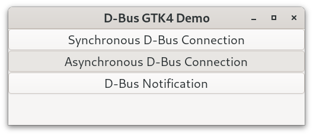
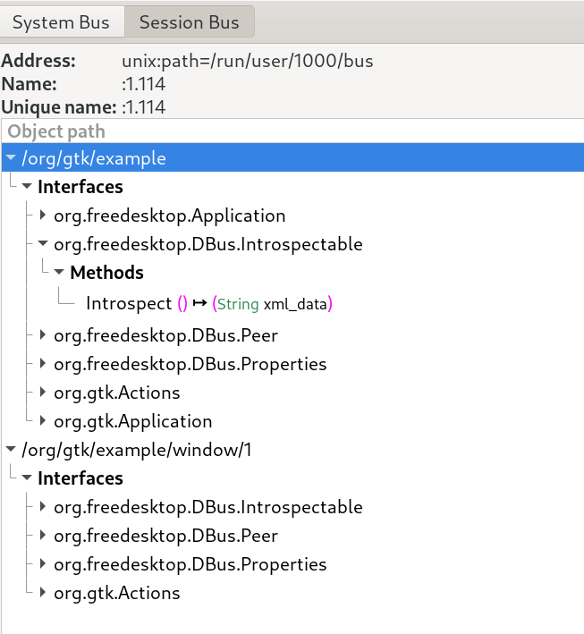
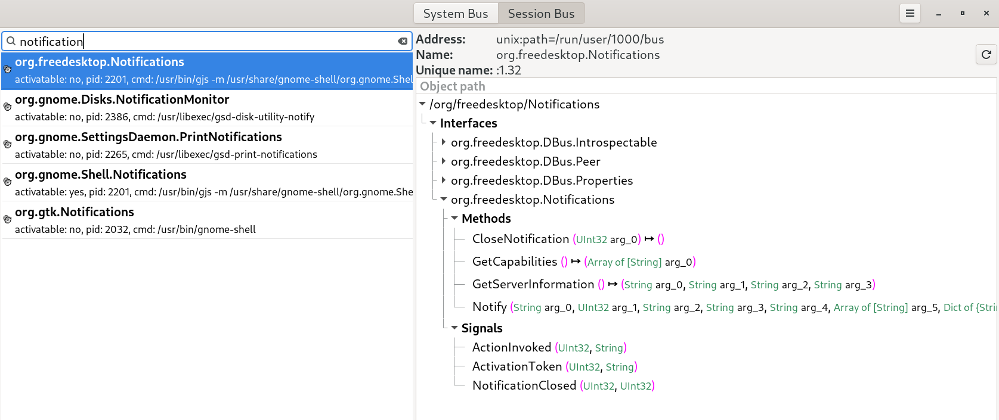
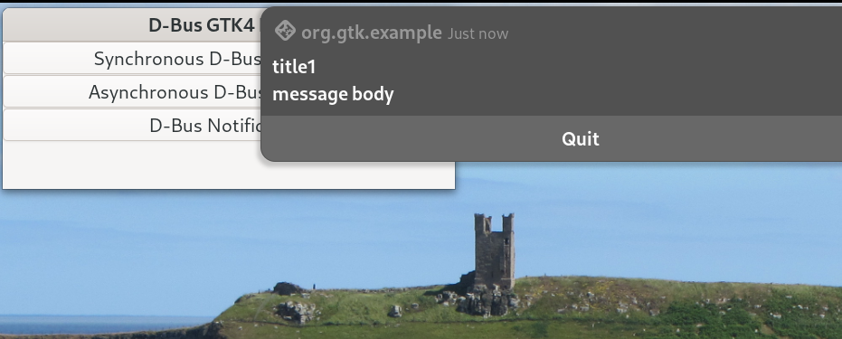

# D-Bus (GTK4, C)

## Introduction

This project consists of a set of code examples showing how to use D-Bus with GTK4 and C on Linux. Most of the D-Bus code uses functions from the [Gio library](https://docs.gtk.org/gio/index.html).

A while back I developed a [GTK4 notification application](https://github.com/crispinprojects/notification-tester) for sending notications using either libnotify and GNotification. I tested this on different Linux operating systems and had a mixed experience when using GNotification and so decided to explore using D-Bus directly (this project!).

You can send D-Bus notifications from the command line using [gdbus](http://www.manpagez.com/html/gio/gio-2.56.0/gdbus.php) which is a tool for working with D-Bus objects. The terminal command to send a test notification is shown below. 

```
gdbus call --session --dest=org.freedesktop.Notifications --object-path=/org/freedesktop/Notifications --method=org.freedesktop.Notifications.Notify "" 0 "" 'Title' 'Notification body' '[]' '{"urgency": <1>}' 5000
```

Ofcourse, there is also the notify-send utility which is available on most Linux distributions as part of the libnotify library. With Fedora you can install it and use it as shown below.

```
sudo dnf install libnotify
notify-send "title" "notification body"
```

However, my goal for this project has been to write some low level GTK4 C code to send notifications directly using the D-Bus [org.freedesktop.Notifications](https://www.freedesktop.org/wiki/) service so that I can use this in other applications that I have been developing. Hopefully, the sample code will be helpful. It took some time understanding how to use D-Bus.

## D-Bus

D-Bus is a message passing system that allows different processes which are running concurrently on the same computer to communicate with each other. This is known as interprocess communication (IPC).  D-Bus is an integral part of the Linux operating system. 

Applications using D-Bus are either servers or clients. A server listens for incoming connections while a client connects to a server. Once the connection is established a client can send a message to the server (which will provide a service) and the server will reply. 

D-Bus provides a message bus daemon allowing multiple programs to exchange messages with one another. A daemon is a computer program running in the background of the Linux operating system and daemons are generally opened when the computer is booted up. In most cases, an application will be a client of the message bus daemon.

In summary, applications using D-Bus are either servers or clients. Servers provide services. Clients talk to services. D-Bus services self-register with the bus, making themselves discoverable to other applications. 

## System Bus Vs Session Bus

D-Bus has two buses (i) a single system bus and (ii) the session bus. The system bus provides system-level functionality that is services which are always available when the computer is turned on such as Bluetooth handling. The session bus provides session level functionality that is only available during a user log-in session. One example of session level functionality is desktop notification support which is the main interest of this project.

## D-Feet

D-Feet is the GNOME D-Bus browser, viewer and degugger application

With Fedora you install it using the terminal command below.

```
dnf search d-feet
sudo dnf install d-feet
```

D-feet allows the D-Bus peers represented by the unique connection names on both the system and session bus to be inspected. I have found it to be very useful when debugging a D-Bus application. Introspection can also be used (see below).

## D-Bus Connection

The function [g_application_get_dbus_connection](https://docs.gtk.org/gio/method.Application.get_dbus_connection.html) gets the GDBusConnection being used by an application which has a unique connection name assigned by the message bus. The code below shows how to make a D-Bus connection and get the unique name.

```
//Establish a GDBusConnection used by the application
GDBusConnection *conn= g_application_get_dbus_connection (g_application_get_default());
//Get the unique name of connection as assigned by the message bus
const gchar* dbus_name =g_dbus_connection_get_unique_name(conn);
g_print("dbus_name = %s\n", dbus_name);
```

The application makes a connection on the session bus. The unique connection name starts with the colon character ":".

## Messages

With D-Bus, messages are transferred between processes. A message has a header (which identifies it) and a message body containing data. 

A D-Bus service application provides one or more interfaces for other applications to use. An interface is a collection of methods, signals, and properties that a service exposes. All D-Bus services should provide an interface called "Introspectable" and a method called "Introspect" to get information about the D-Bus service as an XML string. 

The function [g_dbus_message_new_method_call](https://docs.gtk.org/gio/ctor.DBusMessage.new_method_call.html) creates a new GDBusMessage for a method call. The code below shows how it can be used.  Notice that the call message (request) uses the unique application D-Bus connection name obtained above, the application ID path, the "Introspectable" D-Bus interface name and the "Introspect" method name.

```
GDBusMessage* call_message = g_dbus_message_new_method_call (
    dbus_name,
    "/org/gtk/example",     
    "org.freedesktop.DBus.Introspectable",
    "Introspect");
```

## Synchronously Sending a Message

The function [g_dbus_connection_send_message_with_reply_sync](https://docs.gtk.org/gio/method.DBusConnection.send_message_with_reply_sync.html) synchronously sends the call message (defined above) to the connection and blocks the calling thread until a reply is received or the timeout is reached. The g_dbus_connection_send_message_with_reply() is the asynchronous version of this method and is dicussed in the next section. 

The code below demonstrates using the application connection and the call_message to obtain a reply_message. The [g_dbus_message_get_body](https://docs.gtk.org/gio/method.DBusMessage.get_body.html) gets the body of a message as a GVariant data type. The function g_variant_get_child_value is used to read the first child item out of the GVariant container instance and the function g_variant_get_string is used to convert this to a string for printing purposes. Finally the message objects and variant object are unreferenced.

```
GError* error = NULL;   

GDBusMessage* reply_message = g_dbus_connection_send_message_with_reply_sync
(conn,
call_message,
G_DBUS_SEND_MESSAGE_FLAGS_NONE,
-1,
NULL,
NULL,
&error);

    if(reply_message == NULL)
    {
        g_print("g_dbus_connection_send_message_with_reply_sync failed\n");     
    }

    if(g_dbus_message_get_message_type(reply_message) == G_DBUS_MESSAGE_TYPE_ERROR)
    {
        g_print("Error occured\n");

        g_dbus_message_to_gerror(reply_message, &error);
        g_printerr("Error invoking g_dbus_connection_send_message_with_reply_sync: %s\n", error->message);

        g_error_free(error);

    }


    GVariant* variant = g_dbus_message_get_body(reply_message);

    // get first child and print
    GVariant* var_child = g_variant_get_child_value(variant, 0);
    const gchar* var_str = g_variant_get_string(var_child, NULL);    
    g_print("var_str = %s\n",var_str);

    // cleanup
    g_variant_unref(var_child);
    g_object_unref(call_message);
    g_object_unref(reply_message);
```

## Asynchronously Sending a Message

The function [g_dbus_connection_send_message_with_reply](https://docs.gtk.org/gio/method.DBusConnection.send_message_with_reply.html) asynchronously sends message to a connection. With asynchronous programming, operations can be started, run in the background and then a call back invoked when they are finished. This means that a callback function has to be defined and has the form shown below.

```
static void callbk_async(GObject *source_object,  GAsyncResult *res,  gpointer  user_data)
{  
  g_print("async function called\n"); 
}


g_dbus_connection_send_message_with_reply (
    conn,
    call_message,
    G_DBUS_SEND_MESSAGE_FLAGS_NONE,
    -1,
    NULL,
    NULL,
    callbk_async,
    NULL
    );
```

The GDBusMessage reply_message is now contained inside the asynchronous callback function which gets the body of a message as a GVariant data type and prints this out. The code details are demonstrated in the sample project.

## Compile DBus Sample Project

Download the source code for the D-Bus demo.

Geany is a lightweight source-code editor which can be used to inspect the code. It has an integral terminal.  Use the MAKEFILE to compile code and run it as shown below.

```
make
./demo
```



Running the application and pressing either the synchronous or asynchronous D-Bus buttons  generates XML output on the console which typically looks like that below.

```
dbus_name = :1.114
async callback function invoked
var_str = <!DOCTYPE node PUBLIC "-//freedesktop//DTD D-BUS Object Introspection 1.0//EN"
                      "http://www.freedesktop.org/standards/dbus/1.0/introspect.dtd">
<!-- GDBus 2.80.3 -->
<node>
  <interface name="org.freedesktop.DBus.Properties">
    <method name="Get">
      <arg type="s" name="interface_name" direction="in"/>
      <arg type="s" name="property_name" direction="in"/>
      <arg type="v" name="value" direction="out"/>
    </method>
    <method name="GetAll">
      <arg type="s" name="interface_name" direction="in"/>
      <arg type="a{sv}" name="properties" direction="out"/>
    </method>
    <method name="Set">
      <arg type="s" name="interface_name" direction="in"/>
      <arg type="s" name="property_name" direction="in"/>
      <arg type="v" name="value" direction="in"/>
    </method>
    <signal name="PropertiesChanged">
      <arg type="s" name="interface_name"/>
      <arg type="a{sv}" name="changed_properties"/>
      <arg type="as" name="invalidated_properties"/>
    </signal>
  </interface>
  <interface name="org.freedesktop.DBus.Introspectable">
    <method name="Introspect">
      <arg type="s" name="xml_data" direction="out"/>
    </method>
  </interface>
  <interface name="org.freedesktop.DBus.Peer">
    <method name="Ping"/>
    <method name="GetMachineId">
      <arg type="s" name="machine_uuid" direction="out"/>
    </method>
  </interface>
  <interface name="org.gtk.Actions">
    <method name="List">
      <arg type="as" name="list" direction="out">
      </arg>
    </method>
    <method name="Describe">
      <arg type="s" name="action_name" direction="in">
      </arg>
      <arg type="(bgav)" name="description" direction="out">
      </arg>
    </method>
    <method name="DescribeAll">
      <arg type="a{s(bgav)}" name="descriptions" direction="out">
      </arg>
    </method>
    <method name="Activate">
      <arg type="s" name="action_name" direction="in">
      </arg>
      <arg type="av" name="parameter" direction="in">
      </arg>
      <arg type="a{sv}" name="platform_data" direction="in">
      </arg>
    </method>
    <method name="SetState">
      <arg type="s" name="action_name" direction="in">
      </arg>
      <arg type="v" name="value" direction="in">
      </arg>
      <arg type="a{sv}" name="platform_data" direction="in">
      </arg>
    </method>
    <signal name="Changed">
      <arg type="as" name="removals">
      </arg>
      <arg type="a{sb}" name="enable_changes">
      </arg>
      <arg type="a{sv}" name="state_changes">
      </arg>
      <arg type="a{s(bgav)}" name="additions">
      </arg>
    </signal>
  </interface>
  <interface name="org.gtk.Application">
    <method name="Activate">
      <arg type="a{sv}" name="platform-data" direction="in">
      </arg>
    </method>
    <method name="Open">
      <arg type="as" name="uris" direction="in">
      </arg>
      <arg type="s" name="hint" direction="in">
      </arg>
      <arg type="a{sv}" name="platform-data" direction="in">
      </arg>
    </method>
    <method name="CommandLine">
      <arg type="o" name="path" direction="in">
      </arg>
      <arg type="aay" name="arguments" direction="in">
      </arg>
      <arg type="a{sv}" name="platform-data" direction="in">
      </arg>
      <arg type="i" name="exit-status" direction="out">
      </arg>
    </method>
    <property type="b" name="Busy" access="read">
    </property>
  </interface>
  <interface name="org.freedesktop.Application">
    <method name="Activate">
      <arg type="a{sv}" name="platform-data" direction="in">
      </arg>
    </method>
    <method name="Open">
      <arg type="as" name="uris" direction="in">
      </arg>
      <arg type="a{sv}" name="platform-data" direction="in">
      </arg>
    </method>
    <method name="ActivateAction">
      <arg type="s" name="action-name" direction="in">
      </arg>
      <arg type="av" name="parameter" direction="in">
      </arg>
      <arg type="a{sv}" name="platform-data" direction="in">
      </arg>
    </method>
  </interface>
  <node name="window"/>
</node>
```

Open D-Feet and search for the D-Bus demo application which will be located in the "Session Bus" section. It will be something like :1.(number) with ./demo and an object path name of org.gtk.example which in this case is the application ID. It will display the same information but in graphical form.  See screenshot below.



## Notifications

Sending notification using D-Bus proved to be more challenging. D-Feet showed that the service that I needed was "org.freedesktop.Notifications" with the interface having the same name and a method called "Notify". See screenshot below.



I used introspection to gain an understanding of the arguments that have to be used with the "Notify" method. Introspection is the ability of a program to examine its own structure at runtime. Below shows the terminal command to introspect the "org.freedesktop.Notifications" service.

```
gdbus introspect --session --dest org.freedesktop.Notifications --object-path /org/freedesktop/Notifications --xml > org.freedesktop.Notifications.xml
```

Hunting throught the xml file reveals the arguments that are needed for the "Notify" method. These are shown below.

```
<interface name="org.freedesktop.Notifications">
    <method name="Notify">
      <arg type="s" name="arg_0" direction="in">
      </arg>
      <arg type="u" name="arg_1" direction="in">
      </arg>
      <arg type="s" name="arg_2" direction="in">
      </arg>
      <arg type="s" name="arg_3" direction="in">
      </arg>
      <arg type="s" name="arg_4" direction="in">
      </arg>
      <arg type="as" name="arg_5" direction="in">
      </arg>
      <arg type="a{sv}" name="arg_6" direction="in">
      </arg>
      <arg type="i" name="arg_7" direction="in">
      </arg>
      <arg type="u" name="arg_8" direction="out">
      </arg>
    </method>
```

These are specified in [GVariant](https://docs.gtk.org/glib/gvariant-format-strings.html) text format where, for example, "s" means string, "u" means unsigned integer of type guint32, "as" means an array of strings, "a{sv}" is a dictionary of string-variant pairs and "i" is an integer of type gint32. Aparently the dictionary variant "a{sv}" should be represented like:

```
"{'String': <'variant_value'>, 'String2': <'variant_value'>}"
```

The variant_value could hold a string in one case and an integer in another.

After some more digging around on the internet I came across the argument names.

```
"<interface name='org.freedesktop.Notifications'>"
"<method name='Notify'>"
"<arg type='s' name='app_name' direction='in' />"
"<arg type='u' name='id' direction='in' />"
"<arg type='s' name='icon' direction='in' />"
"<arg type='s' name='summary' direction='in' />"
"<arg type='s' name='body' direction='in' />"
"<arg type='as' name='actions' direction='in' />"
"<arg type='a{sv}' name='hints' direction='in' />"
"<arg type='i' name='timeout' direction='in' />"
"<arg type='u' name='return_id' direction='out' />"
"</method>"
```

At this point I was wondering how do you represent the GVariants "as" and "a{sv}" with C code. My first attempt at creating a GVariant array of type 'as' (array of strings) used the GVariantBuilder approach below. See code snip below.

```
const gchar *actions[] = {"", "Quit"};    
GVariantBuilder builder;
GVariant *notify_actions;
gchar *str; //for printing

// Create a GVariant array of type 'as' (array of strings) 

g_variant_builder_init(&builder, G_VARIANT_TYPE_ARRAY);

for (int i = 0; i < G_N_ELEMENTS(actions); i++) {
    g_variant_builder_add(&builder, "s", actions[i]);
}

notify_actions = g_variant_builder_end(&builder);

// print the GVariant array of type 'as' 
    str = g_variant_print(notify_actions, TRUE);
    g_print("notify_actions: %s\n", str);
```

However, when I used this as the parameter arg_5 in a D-Bus connection call I got a core dumped system crash. I checked the GVariant type using

```
gboolean is_valid_type = g_variant_is_of_type(notify_actions, G_VARIANT_TYPE("as"));
```

which confirmed it was a GVariant of type "as". Very strange!

The best help I could find was from the Gentoo people on this [Gentoo forum](https://forums.gentoo.org/viewtopic-p-6934878.html).

I did a gdbus-codegen on the org.freedesktop.Notifications.xml file generated from interspection. The gdbus-codegen function is the D-Bus code and documentation generator. You do it like this.

```
gdbus-codegen --interface-prefix=org.freedesktop.Notifications --c-namespace FDNotify --generate-c-code=fdnotify org.freedesktop.Notifications.xml
```

Hunting through the generated code for the Notify method revealed the notify call as shown below.

```
void
fdnotify__call_notify (
    FDNotify *proxy,
    const gchar *arg_arg_0,
    guint arg_arg_1,
    const gchar *arg_arg_2,
    const gchar *arg_arg_3,
    const gchar *arg_arg_4,
    const gchar *const *arg_arg_5,
    GVariant *arg_arg_6,
    gint arg_arg_7,
    GCancellable *cancellable,
    GAsyncReadyCallback callback,
    gpointer user_data)
{
  g_dbus_proxy_call (G_DBUS_PROXY (proxy),
    "Notify",
    g_variant_new ("(susss^as@a{sv}i)",
                   arg_arg_0,
                   arg_arg_1,
                   arg_arg_2,
                   arg_arg_3,
                   arg_arg_4,
                   arg_arg_5,
                   arg_arg_6,
                   arg_arg_7),
    G_DBUS_CALL_FLAGS_NONE,
    -1,
    cancellable,
    callback,
    user_data);
}
```

This revealed that the arg_5 actions call has the type

```
const gchar *const *arg_arg_5,
```

and the arg_6 hints call has the type

```
GVariant *arg_arg_6,
```

I ended up defining arg_5 (the actions) as

```
const gchar *const notify_actions[3] = {"","Quit",NULL};
```

and for arg_6 (the hints) as

```
GVariant *notify_hints, *notify_entry[1];
```

The code below shows how I put everything together to create a D-Bus notification. The function [g_dbus_connection_call_sync](https://docs.gtk.org/gio/method.DBusConnection.call_sync.html) has been used which synchronously invokes the "Notify"" method on the interface called "org.freedesktop.Notifications" using the object_path "/org/freedesktop/Notifications" owned by "org.freedesktop.Notifications". The arguments for the "Notify" method are the types discussed above.

```
    GDBusConnection *conn;  
    GError* err = NULL;  
    const gchar *const notify_actions[3] = {"","Quit",NULL};
    GVariant *notify_hints, *notify_entry[1];
    GVariant* result;
    GVariantBuilder b;
    guint32 out;

   conn= g_application_get_dbus_connection (g_application_get_default());
   const gchar* dbus_name =g_dbus_connection_get_unique_name(conn);

   notify_entry[0] = g_variant_new_dict_entry(
               g_variant_new_string("abc"), g_variant_new_variant(g_variant_new_uint32(123))
            );

   notify_hints = g_variant_new_array(G_VARIANT_TYPE("{sv}"),
            notify_entry,
            G_N_ELEMENTS(notify_entry)
         );

      g_variant_builder_init(&b,G_VARIANT_TYPE_ARRAY);     


      for(int i=0;notify_actions[i];i++)
      g_variant_builder_add(&b,"s",notify_actions[i]);


    GVariant *parameters = g_variant_new("(susssas@a{sv}i)",
       "app_name",
         -1,
         "",
         "title1",
         "message body",
         &b,
         notify_hints,
         -1);


      result =g_dbus_connection_call_sync(conn,
       "org.freedesktop.Notifications",
       "/org/freedesktop/Notifications",
       "org.freedesktop.Notifications",
       "Notify",
      parameters,  
      NULL,
      G_DBUS_CALL_FLAGS_NONE,
      -1,
      NULL,
      &err
      );

      out=g_variant_get_uint32(g_variant_get_child_value(result,0));


   if(err)
   {
     g_print("g_dbus_connection_call_sync error\n");  
   }

   //clean up
   for(int i=0; i<G_N_ELEMENTS(notify_entry); i++)
   g_variant_unref(notify_entry[i]);  
   g_variant_unref(notify_hints);

   g_error_free(err);
   g_variant_builder_unref (&b);
   g_variant_unref(parameters);
   g_variant_unref(result); 

   g_object_unref(conn); 
```

The screenshot below shows how the D-Bus notification is displayed. It works but the code has been developed by trial and error and so may not be best practice. I had to use introspection and code generation to get a working example.



## Client Server Application

A minimal D-BUS client server sample application can be found [here](https://github.com/linneman/dbus-example) and [here](https://github.com/joprietoe/gdbus/tree/master). Compile both the client and server code and then run both in separate terminal tabs. The client connects to the server with a message and the server replies.

## Summary

This project illustrates how to get started with D-BUS communications providing some GTK4 C sample code. It shows how a notification can be sent using the "org.freedesktop.Notifications.Notify" method. Hopefully, the sample code will be helpful.

If just want a simple approach to sending notifications then just install and use the [libnotify](https://gitlab.gnome.org/GNOME/libnotify) library as sending notification is as simple as the code snip shown below.

```
    #include <libnotify/notify.h>

    const gchar* title ="hello";
    const gchar* body = "world";

    NotifyNotification *notify;
    notify_init("notification"); 
    notify = notify_notification_new(title, body, NULL);
    notify_notification_set_urgency (notify, NOTIFY_URGENCY_NORMAL);
    notify_notification_show(notify,NULL); 
```

See my full code example [here](https://github.com/crispinprojects/notification-tester). 

If the libnotify library is not available on your system or you just do not want to use it you could do system "gdbus call" in your code as shown below.

```
    gchar * command_str ="gdbus call ";
    command_str =g_strconcat(command_str,"--session ", NULL);     
    command_str =g_strconcat(command_str,"--dest=org.freedesktop.Notifications ", NULL); 
    command_str =g_strconcat(command_str,"--object-path=/org/freedesktop/Notifications ", NULL); 
    command_str =g_strconcat(command_str,"--method=org.freedesktop.Notifications.Notify ", NULL);
    command_str =g_strconcat(command_str,"\"\" 0\"\" ", NULL);
    command_str =g_strconcat(command_str,"\'\' ", NULL);
    command_str =g_strconcat(command_str,"\'Example notification\' ", NULL);
    command_str =g_strconcat(command_str,"\'Message\' ", NULL);    
    command_str =g_strconcat(command_str,"\'[]\' ", NULL);
    command_str =g_strconcat(command_str,"\'{}\' 5000 ", NULL);
    g_print("command_str = %s\n", command_str);
    system(command_str); 
```

## License

GTK is released under the terms of the [GNU Lesser General Public License version 2.1](https://www.gnu.org/licenses/old-licenses/lgpl-2.1.html). Consequently, this GTK4 D-Bus sample code application is licensed under the same LGPL v2.1 license.

## Acknowledgements

* [GTK](https://www.gtk.org/)

* GTK is a free and open-source project maintained by GNOME and an active community of contributors. GTK is released under the terms of the [GNU Lesser General Public License version 2.1](https://www.gnu.org/licenses/old-licenses/lgpl-2.1.html).

* [GTK4 API](https://docs.gtk.org/gtk4/index.html)

* [GObject API](https://docs.gtk.org/gobject/index.html)

* [Glib API](https://docs.gtk.org/glib/index.html)

* [Gio API](https://docs.gtk.org/gio/index.html)

* [Freedesktop official d-bus tutorial](https://dbus.freedesktop.org/doc/dbus-tutorial.html)

* [Freedesktop d-bus wiki](https://www.freedesktop.org/wiki/Software/dbus/)

* [Geany](https://www.geany.org/) is a lightweight source-code editor (version 2 now uses GTK3). [GPL v2 license](https://www.gnu.org/licenses/old-licenses/gpl-2.0.txt)

* [Fedora](https://fedoraproject.org/)

* [Ubuntu](https://ubuntu.com/download/desktop)

* [Debian](https://www.debian.org/)
